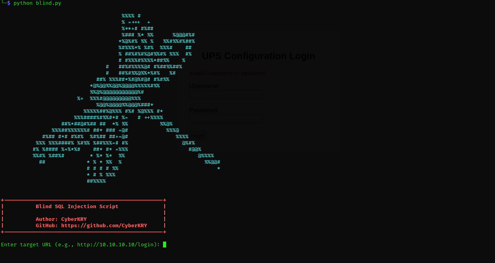

# 🔧 blind-sqli-tool


🛠️ This script was created during a CTF competition. It was successfully used against a real vulnerable target.
It fully automates the process of time-based Blind SQL Injection — extracting the database name, table names, column names, and row data.
A practical tool for penetration testers, CTF players, and security learners.

## 🚀 Features
- Retrieving a database name
- List of tables
- Column list
- Data from the first rows

## 🛠️ Usage

```bash
git clone https://CyberKRY/blind-sqli-tool.git
cd blind-sqli-tool
python blind.py
```
The script is as simple as possible, all you need to do is enter the IP address of the landing page.

> The script works exclusively with websites that have a login form that accepts POST data.

This is how the interface of the script itself looks like:



Once you provide the target URL, the script automatically launches the blind SQL injection process. It will begin by brute-forcing and printing the name of the database.
